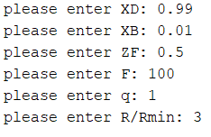
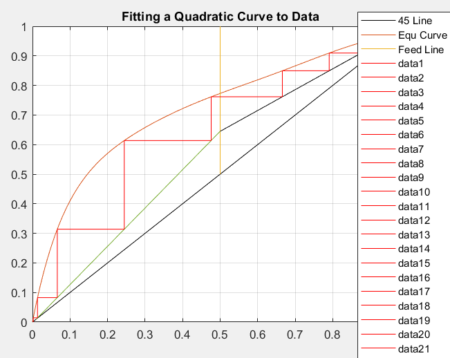
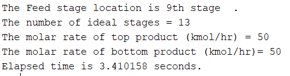

# Maccabe-Thiele-Unit-Operations
The McCabe-Thiele method is a graphical tool to design distillation columns for binary mixtures, determining the number of ideal stages using equilibrium and operating lines. It assumes ideal conditions and cannot model non-ideal behavior or multicomponent systems, limiting its real-world applicability

In this project I have coded three systems but also I uploaded a generic code that you can determine constants and data to obtain your own diagram and stages.

**About inputs of code please becareful that:**
   - XD=Distillate product composition of system which we want to reach
   - XB=Bottom product composition of system which plays role of waste in our sytem
   - q=The ratio of added material via Feed to liquid phase and Feed
   - ZF=Composition of Feed 
   - F=Flow rate of Feed 
   - R= It is reflux ratio(amount of vapour in which returns to column)
   - Rmin=It is minimum number of reflux that can occure in each system
   - For calculating minimum reflux ratio at first you shoud find tie_line in which crosses F on diagram.Then connect it to vertical line crossing XD.Now you can get this number.This is important in such sysems because this is the base number of reflux ratio for each system.

**As an example I did a sample of Mccabe and you can see following:**

   

   

   
